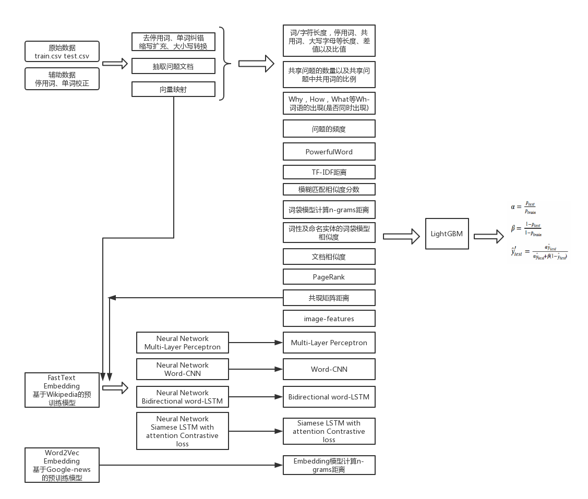

# quora-question-pairs
七月在线集训营第6期NLP结业项目

## 项目概述

该解法融合了统计特征, 传统NLP特征, 深度学习特征以及图特征，最终生成了大约180个特征，送入到一个LightGBM进行训练。模型使用了早停法用于调参。




## 操作细节


### 硬件要求

所有的代码都可以在多核机器上进行并行操作，但是注意有些代码生成特征非常的耗时间。建议使用20GB以上的内存以及GPU（跑深度网络代码）
此外，需要30GB的磁盘空间来存储各种预训练的word embeddings以及生成的特征文件。

### 软件要求

1. Python >= 3.6
2. [LightGBM](https://github.com/Microsoft/LightGBM) (compiled from sources)
3. [FastText](https://github.com/facebookresearch/fastText) (compiled from sources)
4. Python packages from `requirements.txt`
5. (Recommended) NVIDIA CUDA and a GPU version of TensorFlow


### 代码运行步骤

运行如下顺序的notebooks文件:

1. **预处理**.
    ```
    1) preproc-tokenize-spellcheck.ipynb
    2) preproc-extract-unique-questions.ipynb
    3) preproc-embeddings-fasttext.ipynb
    4) preproc-nn-sequences-fasttext.ipynb
    ```

2. **特征生成**.

    运行所有的 `feature-*.ipynb`文件。
    
    *注意*: 建议在有GPU和NVIDIA CUDA的机子上运行所有的`feature-oofp-nn-*.ipynb`文件。
    
3. **Prediction**.

    运行`final-pred.ipynb`
    生成提交文件`DATETIME-submission-draft-*.csv`。

